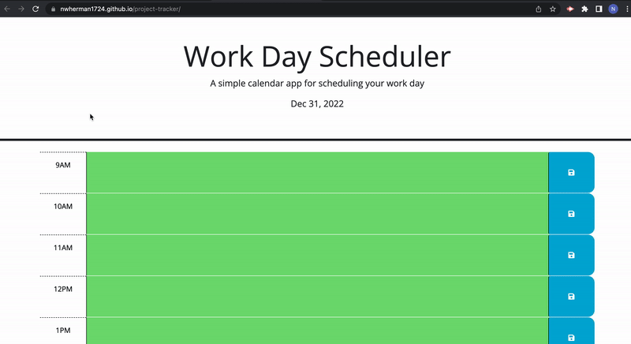

# weather-dashboard

## Table of Contents

- Description
- User Story
- Accceptance Criteria
- Screenshots
- Credits

## TODO

HTML backbone (x)
CSS Layout (x)
API Connection (x)
API Use

## Description

This is the sixth Module challenge in the MSU Full-Stack coding bootcamp. It will exercise knowledge of HTML, CSS, JavaScript, Git/Github, and third-party APIs. The objective of this project is to create a weather dashboard that can search cities, display todays weather, and display a 5 day forecast. The user story and acceptance criteria for the project have their own sections below.

Github Pages Link: https://nwherman1724.github.io/weather-dashboard/

## User Story

```md
AS A traveler
I WANT to see the weather outlook for multiple cities
SO THAT I can plan a trip accordingly
```

## Acceptance Criteria

```md
GIVEN a weather dashboard with form inputs
WHEN I search for a city
THEN I am presented with current and future conditions for that city and that city is added to the search history
WHEN I view current weather conditions for that city
THEN I am presented with the city name, the date, an icon representation of weather conditions, the temperature, the humidity, and the the wind speed
WHEN I view future weather conditions for that city
THEN I am presented with a 5-day forecast that displays the date, an icon representation of weather conditions, the temperature, the wind speed, and the humidity
WHEN I click on a city in the search history
THEN I am again presented with current and future conditions for that city
```

## Demonstration

The following animation demonstrates the application functionality:



## Credits

Project provided by MSU Full-Stack Coding Bootcamp

- - -
© 2022 edX Boot Camps LLC. Confidential and Proprietary. All Rights Reserved.
